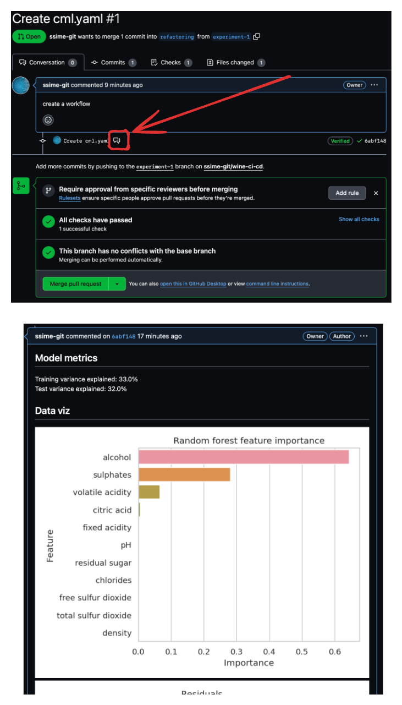

# CI using Wine quality prediction

## Sources

1. Modelling a Kaggle dataset of [red wine properties and quality ratings](https://www.kaggle.com/uciml/red-wine-quality-cortez-et-al-2009).

2. CML repo (to get the action workflow): https://github.com/iterative/cml

3. This awesome video : https://youtu.be/9BgIDqAzfuA

## setup

```py
# create teh venv
python3 -m venv .venv

# activate
source .venv/bin/activate

# install reqs
make install

# run the script
python3 src/main.py
```

> when running from the root, make sure to the path correctly.

## Step 1 : Refactor the code into modular script

Refactor the `main.py` script following the below logic :

In software engineering, best practices suggest that a file like train.py should be modular, readable, and maintainable. This often involves splitting it into separate files or modules based on its responsibilities. Here's how train.py might be split up:

* Data Preparation: Create a module or script for data loading and preprocessing, such as `data_prep.py`.
* Model Training & evaluation : A separate module for model training, such as `train_model.py`.
* Visualization: Code for generating plots could go into a `plotting.py` module.
* Utilities: Any repeated utility parameter could be placed in a config.py file.

Each module should have a clear, single responsibility, making it easier to maintain and update the code. Additionally, this facilitates unit testing for each individual component.

> You can use different filename, just keep the logic.

##  Step 2: create a github workflow associated to a branch and a PR

1. Get you github token : `your-account > developer setting > Token(classic)`
2. Create the workflow `cml.yaml`file with the following content :

```yaml
name: model-wine-quality
on: [push]
jobs:
  run:
    runs-on: [ubuntu-latest]
    container: docker://dvcorg/cml-py3:latest
    steps:
      - uses: actions/checkout@v2
      - name: cml_run
        env:
          repo_token: ${{ secrets.SECRET_GITHUB_TOKEN }}
        run: |

          # Your ML workflow goes here
          pip install -r requirements.txt
          python src/main.py
          
          echo "## Model metrics" > report.md
          cat report/metrics.txt >> report.md
          
          echo "## Data viz" >> report.md
          cml-publish report/feature_importance.png --md >> report.md
          cml-publish report/residuals.png --md >> report.md
          
          cml-send-comment report.md
```

Upon validation, call the branch `experiment-1` and describe in the PR what changed.

## Step 3: inspect the PR

After PR inspection, you should be able to see the following report:



## Step 3 : Merge the PR on main branch

## Step 4 : Make a change in the main file

try to change the depth in the `config.py` file and push change from the UI.